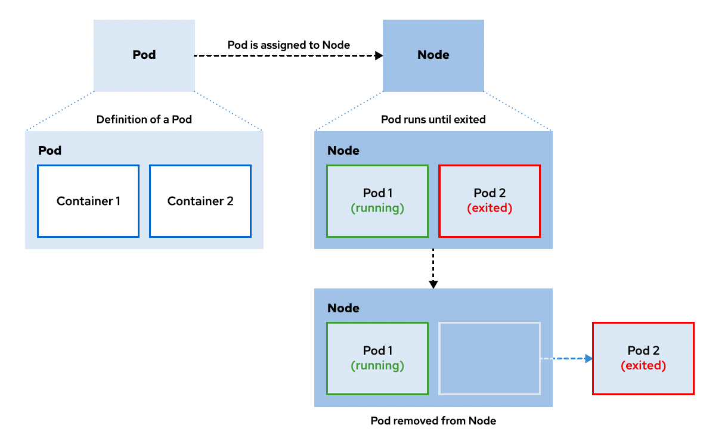

### Introducción y descripción general de los contenedores

#### Descripción de Contenedores
- Un contenedor es un proceso encapsulado que incluye las dependencias de tiempo de ejecución necesarias para ejecutar el programa.

- Un motor de contenedores crea un sistema de archivos de unión fusionando capas de imágenes de contenedores

- Los contenedores son efímeros de forma predeterminada, lo que significa que el motor de contenedores elimina la capa de escritura cuando se elimina el contenedor.

##### Imágenes contra instancias
- Los contenedores se pueden dividir en dos:
 -- Imagenes de Contenedor : Contiene datos inmutables
 -- Instancias de Contenedor: Puede usarse varias veces para crear muchas instancias de contenedor distintas
Las imágenes de contenedor se pueden usar para crear instancias de contenedor

##### Contenedores Vs Maquinas Virtuales
- Los contenedores generalmente cumplen un rol similar a las máquinas virtuales (VM), donde una aplicación reside en un entorno autónomo con redes virtualizadas para la comunicación.

- Una máquina virtual es útil cuando se requiere un entorno de computación completo adicional, como cuando una aplicación requiere hardware específico y dedicado.

- Debido a que un contenedor requiere muchos menos recursos que una máquina virtual, los contenedores tienen beneficios de rendimiento y recursos a mayor escala.

- Implementación a Escala: Un método común en entornos a gran escala es usar contenedores que se ejecutan dentro de las máquinas virtuales. Esta configuración aprovecha los puntos fuertes de cada tecnología.

- Pruebas y flujos de trabajo: Los desarrolladores que usan contenedores pueden aprovechar pipelines (CI/CD) para implementar contenedores en diversos entornos

- Estabilidad: Debido a que las librerías están incluidas en la imagen del contenedor, un desarrollador (developer) puede estar seguro de que no habrá problemas de dependencia en una implementación

- Continuidad: Los contenedores pueden ser de la misma imagen para réplicas de alta disponibilidad (HA) o de varias imágenes diferente

#### Introducción a Kubernetes
- Es un servicio de orquestación que simplifica la implementación, la administración y el escalamiento de las aplicaciones contenerizadas. Gestiona conjuntos (pools) complejos de recursos, como CPU, RAM, almacenamiento y redes.
- La unidad gestionable más pequeña es un **pod**, que representa una sola aplicación y consta de uno o más contenedores, incluidos los recursos de almacenamiento y una dirección IP.

##### Características
- Detección de servicios y balanceos de carga
- Escalamiento horizontal
- Reparación automatica
- Implementación automatizada
- Administración de Secrets y configuración
- Operadores

#### Introducción a OpenShift
- Es un conjunto de componentes y servicios modulares desarrollados sobre la base de una infraestructura de contenedores de Kubernetes
- Cuenta con capacidades para una plataforma de producción, como gestión remota, mayor seguridad, monitoreo y auditoría, administración del ciclo de vida de la aplicación e interfaces de autoservicio para desarrolladores

##### Características
- Flujo de trabajo de desarrollador
    - Pipelines (CI/CD)
    - Fuente a imagenes (S2I)
- Router (Rutas para el exterior - publicas)
- Metricas y registro
- Interfaz de usuario unificada

#### Ciclo de vida de aplicaciones en RHOCP
1. Comienza la definición del pod
2. Los pods se asignan a un nodo en buen estado.
3. Los pods se ejecutan hasta que sus contenedores terminan.
4. Los pods y sus contenedores se eliminan del nodo.

 Resumen

- Los contenedores se diferencian de las máquinas virtuales al proporcionar solo las dependencias de tiempo de ejecución necesarias, como las librerías específicas de la aplicación necesarias para que se ejecute un programa, en lugar de un sistema operativo completo. 
- Las imágenes de contenedor se pueden usar para crear instancias de contenedor que son versiones ejecutables de la imagen que incluyen referencias a redes, discos y otras necesidades de tiempo de ejecución. 
    - Podman es un motor de contenedores para construir y ejecutar contenedores en un host individual.
    - Kubernetes y Red Hat OpenShift Container Platform (RHOCP) gestionan u orquestan contenedores en varios hosts denominados nodos. 
- RHOCP es un conjunto de componentes y servicios modulares que se crean sobre Kubernetes para agregar capacidades para las siguientes características:  
    - Gestión remota  
    - Varios inquilinos  
    - Mayor seguridad  
    - Integración continua  
    - Desarrollo continuo  

